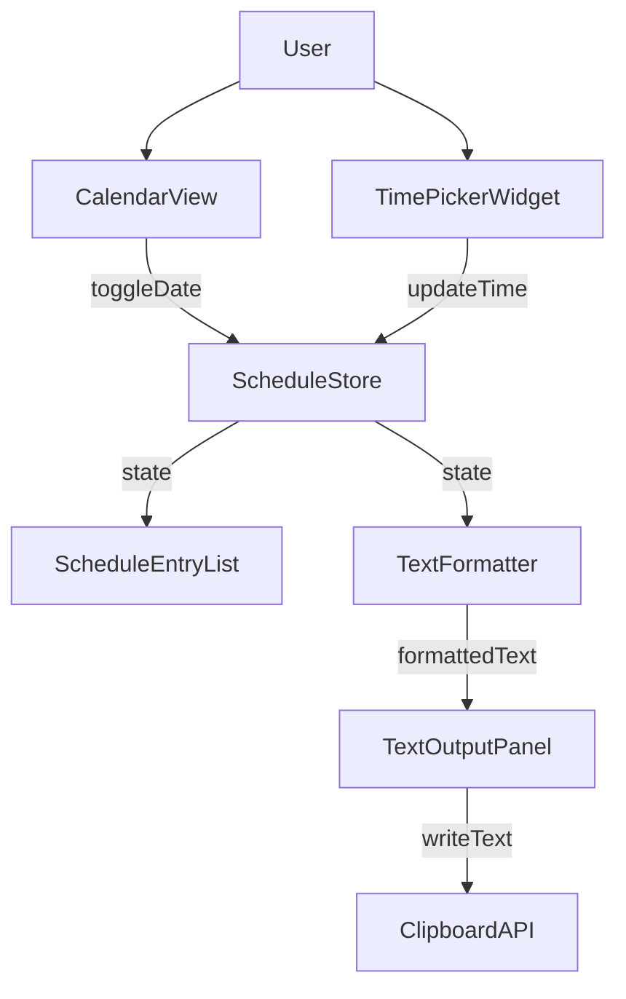
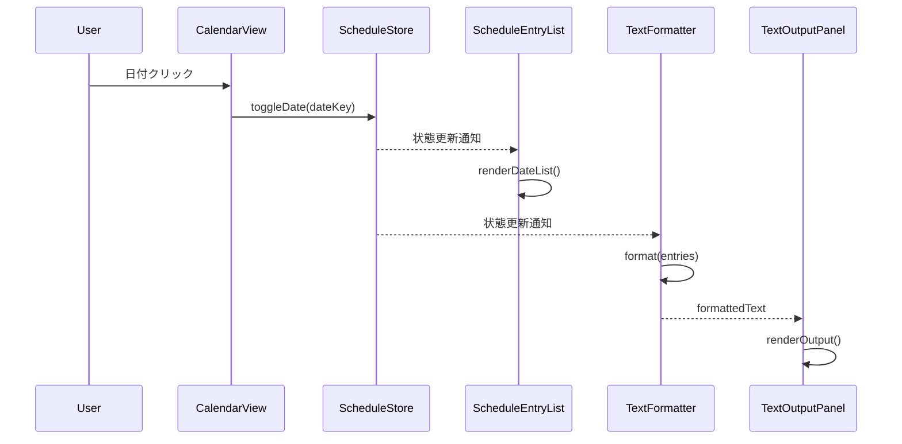
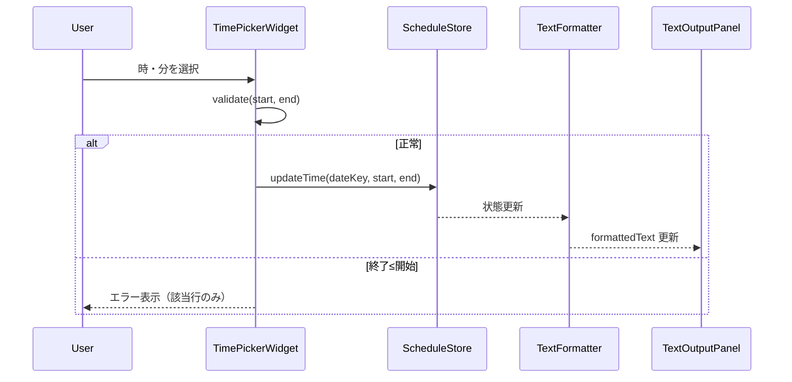

# 技術設計書 — スケジュールテキストジェネレーター

## Overview

本機能は、カレンダーから日付を複数選択し、日付ごとに開始・終了時刻を入力することで `2026/03/26(木) 20:00~21:00` 形式のスケジュール提示テキストを即時生成するWebアプリケーションである。

**Purpose**: ユーザーがスケジュール情報を手早く整形テキストに変換し、コピーして他のアプリに貼り付けられるようにする。
**Users**: スケジュールを他者に共有・提示する一般ユーザー。
**Impact**: フロントエンド単体で完結する新規グリーンフィールド実装。既存システムへの影響なし。

### Goals

- カレンダーUIによる複数日付の選択・解除
- 日付ごとに独立した時刻入力（00/30分クイック選択＋任意入力）
- `YYYY/MM/DD(曜日) HH:MM~HH:MM` 形式のリアルタイムテキスト生成
- ワンクリックでのクリップボードコピー

### Non-Goals

- サーバーサイド処理・API通信
- ユーザー認証・データ永続化
- テンプレートの複数種類対応
- カレンダーの複数月同時表示

---

## Architecture

### Architecture Pattern & Boundary Map

単一HTMLファイル上のコンポーネントベースSPA。状態は中央の `ScheduleStore`（インメモリ Map）に集約し、UI コンポーネントが状態変化イベントを受けて DOM を再描画する。フレームワーク非依存のバニラJS実装（詳細は `research.md` — "フロントエンドフレームワーク選定" 参照）。



**Key Decisions**:
- `ScheduleStore` が唯一の状態源（Single Source of Truth）
- 状態変更はすべて `ScheduleStore` 経由で行い、直接DOM操作は行わない
- `TextFormatter` は純粋関数として実装し、副作用を持たない

### Technology Stack

| Layer | Choice | Role | Notes |
|-------|--------|------|-------|
| Frontend | HTML5 / CSS3 / Vanilla JS (ES2022) | UI・ロジック・スタイル | ビルドツール不要、単一ファイル |
| Runtime | ブラウザ（モダン） | 実行環境 | Chrome/Firefox/Safari/Edge |
| Clipboard | Clipboard API + Selection fallback | テキストコピー | HTTPS / localhost で動作 |
| Data Storage | なし（インメモリ） | 状態管理 | ページリロードで消失 |

---

## System Flows

### 日付選択〜テキスト生成フロー



### 時刻入力フロー



---

## Requirements Traceability

| Requirement | Summary | Components | Interfaces | Flows |
|-------------|---------|------------|------------|-------|
| 1.1 | カレンダーUI表示・日付クリック選択 | CalendarView | `toggleDate` | 日付選択フロー |
| 1.2 | 未選択日付のクリックで選択 | CalendarView, ScheduleStore | `toggleDate` | 日付選択フロー |
| 1.3 | 選択済み日付のクリックで解除 | CalendarView, ScheduleStore | `toggleDate` | 日付選択フロー |
| 1.4 | 複数日付の同時選択 | ScheduleStore | `ScheduleState` | — |
| 1.5 | 選択日付のハイライト表示 | CalendarView | `renderCalendar` | — |
| 1.6 | 月送り・月戻し操作 | CalendarView | `navigateMonth` | — |
| 2.1 | 日付選択時に時刻フィールド表示 | ScheduleEntryList, TimePickerWidget | `renderDateList` | 時刻入力フロー |
| 2.2 | 日付ごとに独立した時刻フィールド | ScheduleEntryList | `ScheduleEntry` | — |
| 2.3 | 時刻UI（時セレクト＋分00/30/その他） | TimePickerWidget | `TimePickerWidget` | — |
| 2.4 | 終了≤開始のバリデーション | TimePickerWidget | `validate` | 時刻入力フロー |
| 2.5 | HH:MM 24時間表記 | TimePickerWidget, TextFormatter | `TimeValue` | — |
| 2.6 | 日付解除時に時刻フィールド除去 | ScheduleEntryList | `renderDateList` | 日付選択フロー |
| 3.1 | YYYY/MM/DD(曜日) HH:MM~HH:MM 形式生成 | TextFormatter | `formatEntries` | テキスト生成フロー |
| 3.2 | 曜日自動計算（日本語略称） | TextFormatter | `getDayOfWeekJa` | — |
| 3.3 | 日付昇順ソート | TextFormatter | `formatEntries` | — |
| 3.4 | リアルタイム更新 | ScheduleStore, TextOutputPanel | `onChange` | テキスト生成フロー |
| 3.5 | 未選択時のガイダンス表示 | TextOutputPanel | `renderOutput` | — |
| 4.1 | 生成テキストの表示エリア | TextOutputPanel | `renderOutput` | — |
| 4.2 | コピーボタン→クリップボード書き込み | TextOutputPanel | `copyToClipboard` | — |
| 4.3 | コピー完了フィードバック | TextOutputPanel | `showCopyFeedback` | — |
| 4.4 | クリップボードAPI非対応時のフォールバック | TextOutputPanel | `copyToClipboard` | — |

---

## Components and Interfaces

### コンポーネント概要

| Component | Layer | Intent | Req Coverage | Key Dependencies |
|-----------|-------|--------|--------------|-----------------|
| CalendarView | UI | カレンダー描画・日付選択トグル | 1.1〜1.6 | ScheduleStore (P0) |
| ScheduleEntryList | UI | 選択日付リスト＋時刻ピッカー描画 | 2.1, 2.2, 2.6 | ScheduleStore (P0), TimePickerWidget (P0) |
| TimePickerWidget | UI | 時・分の選択UI（00/30/カスタム） | 2.3〜2.5 | — |
| TextFormatter | Logic | スケジュールエントリーをテキストに変換 | 3.1〜3.3 | — |
| TextOutputPanel | UI | 生成テキスト表示＋コピー | 3.4, 3.5, 4.1〜4.4 | TextFormatter (P0), Clipboard API (P1) |
| ScheduleStore | State | 選択日付・時刻のインメモリ状態管理 | 1.2〜1.4, 2.2, 3.4 | — |

---

### State Layer

#### ScheduleStore

| Field | Detail |
|-------|--------|
| Intent | 選択日付と時刻データのインメモリ一元管理 |
| Requirements | 1.2, 1.3, 1.4, 2.2, 3.4 |

**Responsibilities & Constraints**
- `Map<DateKey, ScheduleEntry>` を唯一の状態源として保持する
- 状態変更後に登録された `onChange` コールバックを呼び出し、UI 再描画を促す
- 日付の追加・削除・時刻更新のみを受け付け、フォーマット処理は行わない

**Contracts**: State [x]

##### State Management

```typescript
type DateKey = string; // "YYYY-MM-DD"
type TimeValue = string; // "HH:MM" (24h) | ""

interface ScheduleEntry {
  date: Date;
  dateKey: DateKey;
  start: TimeValue;
  end: TimeValue;
}

type ScheduleState = Map<DateKey, ScheduleEntry>;

interface ScheduleStore {
  getState(): ScheduleState;
  toggleDate(date: Date, dateKey: DateKey): void;
  updateTime(dateKey: DateKey, start: TimeValue, end: TimeValue): void;
  subscribe(callback: () => void): () => void; // returns unsubscribe fn
}
```

- Preconditions: `dateKey` は `YYYY-MM-DD` 形式
- Postconditions: `toggleDate` 後、`getState()` に変更が反映される
- Invariants: 同一 `dateKey` のエントリーは常に1件のみ存在する

---

### Logic Layer

#### TextFormatter

| Field | Detail |
|-------|--------|
| Intent | ScheduleState を `YYYY/MM/DD(曜日) HH:MM~HH:MM` 形式テキストに変換する純粋関数 |
| Requirements | 3.1, 3.2, 3.3 |

**Responsibilities & Constraints**
- 副作用を持たない純粋関数として実装する
- バリデーションエラー（終了≤開始）のエントリーは出力から除外する
- エントリーを `dateKey` 辞書順（昇順）でソートして出力する

**Contracts**: Service [x]

##### Service Interface

```typescript
interface TextFormatterService {
  formatEntries(state: ScheduleState): string;
  getDayOfWeekJa(date: Date): string; // "月"|"火"|...|"日"
  formatLine(entry: ScheduleEntry): string | null; // null if invalid
}
```

- Preconditions: `state` は有効な `ScheduleState`
- Postconditions: 返値は改行区切りの整形済みテキスト、またはエントリーが0件なら空文字
- Invariants: 入力 `state` を変更しない

**Implementation Notes**
- `getDayOfWeekJa`: `['日','月','火','水','木','金','土'][date.getDay()]`
- `formatLine`: `start`/`end` が両方空の場合は日付のみを出力。片方でも入力済みなら `--:--` でプレースホルダー表示
- バリデーション: `start && end && end <= start` の場合 `null` を返す

---

### UI Layer

#### CalendarView

| Field | Detail |
|-------|--------|
| Intent | 月単位カレンダーを描画し、日付クリックで ScheduleStore を更新する |
| Requirements | 1.1〜1.6 |

**Responsibilities & Constraints**
- 現在の表示月（`viewYear`, `viewMonth`）を内部状態として保持する
- `ScheduleStore` の状態を参照して選択済み日付をハイライトする
- 月ナビゲーション（前月・翌月）の操作を提供する

**Dependencies**
- Outbound: ScheduleStore — `toggleDate` 呼び出し (P0)
- Inbound: ScheduleStore — 選択状態の取得 (P0)

**Contracts**: State [x]

##### State Management

```typescript
interface CalendarViewState {
  viewYear: number;
  viewMonth: number; // 0-indexed
}

interface CalendarView {
  render(): void;
  navigateMonth(delta: -1 | 1): void; // -1: 前月, 1: 翌月
}
```

**Implementation Notes**
- `render`: `new Date(viewYear, viewMonth, 1).getDay()` で月初曜日を算出し空白セルを生成
- 日曜=赤、土曜=青、今日=青文字ボールドで視覚的に区別
- 選択済み日付は `selected` CSSクラスで青背景表示

---

#### TimePickerWidget

| Field | Detail |
|-------|--------|
| Intent | 1件の時刻（開始または終了）を時セレクト＋分セレクト（00/30/その他）で入力する |
| Requirements | 2.3, 2.4, 2.5 |

**Contracts**: Service [x]

##### Service Interface

```typescript
interface TimePickerWidget {
  getValue(): TimeValue; // "HH:MM" | ""
  render(container: HTMLElement): void;
}

type TimePickerConfig = {
  initialValue: TimeValue;
  onChange: (value: TimeValue) => void;
};
```

**Implementation Notes**
- 時: `<select>` 要素、`--`（未選択）+ `00`〜`23`
- 分: `<select>` 要素、`--`（未選択）/ `00` / `30` / `その他`
- `その他` 選択時: `<input type="text" maxlength="2">` を表示。数字以外は除去し 0〜59 の範囲を検証する
- `getValue()`: 時・分いずれかが未入力なら `""` を返す

---

#### ScheduleEntryList

| Field | Detail |
|-------|--------|
| Intent | 選択日付を昇順リストで描画し、各行に TimePickerWidget（開始・終了）を配置する |
| Requirements | 2.1, 2.2, 2.6 |

**Implementation Notes**
- `ScheduleStore.subscribe` で状態変化を購読し `renderDateList()` を呼び出す
- 選択0件時: 「カレンダーから日付を選択してください」ガイダンスを表示（要件3.5 に対応）
- 各行の `TimePickerWidget.onChange` → `ScheduleStore.updateTime` → `TextFormatter` の順で更新を伝播する

---

#### TextOutputPanel

| Field | Detail |
|-------|--------|
| Intent | 生成テキストを表示し、クリップボードコピー機能を提供する |
| Requirements | 3.4, 3.5, 4.1〜4.4 |

**Dependencies**
- External: Clipboard API — `navigator.clipboard.writeText()` (P1)

**Contracts**: Service [x]

##### Service Interface

```typescript
interface TextOutputPanel {
  renderOutput(text: string): void;
  copyToClipboard(): Promise<void>;
  showCopyFeedback(success: boolean): void;
}
```

**Implementation Notes**
- Integration: `ScheduleStore.subscribe` → `TextFormatter.formatEntries` → `renderOutput` の順でリアルタイム更新
- Validation: `text` が空文字またはプレースホルダー状態の場合、コピーボタンを非活性または無視する
- Risks: Clipboard API は HTTPS 環境外では利用不可。`try/catch` で `Selection API` フォールバックへ切り替える
  - フォールバック: `document.createRange()` + `window.getSelection().addRange()` でテキスト選択状態にし、「テキストを選択しました」を表示する

---

## Data Models

### Domain Model

**集約**: `ScheduleState`（`Map<DateKey, ScheduleEntry>`）
**エンティティ**: `ScheduleEntry`（識別子: `dateKey`）
**値オブジェクト**: `TimeValue`（不変の `"HH:MM"` 文字列）

**業務ルール・不変条件**:
- 同一日付のエントリーは1件のみ存在する
- `end > start` でなければテキスト生成対象外とする（バリデーションエラー）
- `dateKey` は `YYYY-MM-DD` 形式を厳守する

### Logical Data Model

```
ScheduleEntry
├── dateKey: string       (PK, "YYYY-MM-DD")
├── date: Date            (JavaScriptのDateオブジェクト)
├── start: string         ("HH:MM" | "")
└── end: string           ("HH:MM" | "")
```

カーディナリティ: ユーザーセッション 1 に対して ScheduleEntry 0..N

### Data Contracts & Integration

生成テキストフォーマット（出力契約）:
```
YYYY/MM/DD(曜日) HH:MM~HH:MM
```

例:
```
2026/03/26(木) 20:00~21:00
2026/03/27(金) 19:00~21:30
```

---

## Error Handling

### Error Strategy

フロントエンド単体アプリのため、エラーはすべてUIレベルでユーザーにフィードバックする。システムクラッシュを防ぐ Graceful Degradation を優先する。

### Error Categories and Responses

**ユーザー入力エラー**:
| シナリオ | 検出タイミング | 応答 |
|----------|--------------|------|
| 終了時刻 ≤ 開始時刻 | `TimePickerWidget.onChange` | 該当行にエラーメッセージ表示、出力から除外 |
| 分の手動入力が範囲外（<0, >59） | `TimePickerWidget` テキスト入力 | 0〜59 に補正またはクリア |
| 日付未選択でコピー操作 | `TextOutputPanel.copyToClipboard` | コピー処理をスキップ |

**システムエラー**:
| シナリオ | 検出タイミング | 応答 |
|----------|--------------|------|
| Clipboard API 利用不可 | `copyToClipboard` の catch | Selection API フォールバックへ切り替え、手動コピー促進メッセージ表示 |

---

## Testing Strategy

### Unit Tests

- `TextFormatter.formatEntries`: 単一エントリー・複数エントリー・バリデーションエラーエントリーの除外
- `TextFormatter.getDayOfWeekJa`: 各曜日の正しいマッピング検証
- `TextFormatter.formatLine`: 時刻なし・時刻あり・バリデーションエラーの各パターン
- `ScheduleStore.toggleDate`: 選択→解除のトグル動作と `subscribe` コールバック呼び出し
- `TimePickerWidget.getValue`: 時未入力・分未入力・両方入力の各パターン

### Integration Tests

- カレンダー日付クリック → `ScheduleEntryList` に行が追加される
- 時刻入力 → `TextOutputPanel` の生成テキストがリアルタイム更新される
- 日付解除 → 対応する時刻入力行が消え、生成テキストからも除外される
- コピーボタン → フィードバック表示が2秒後に元のラベルに戻る

### E2E / UI Tests

- 複数日付を選択して時刻を入力し、生成テキストが正しい形式・昇順であることを確認
- 終了≤開始の入力でエラー表示かつテキストが除外されることを確認
- コピーボタンクリックでクリップボードに正しいテキストが書き込まれることを確認
